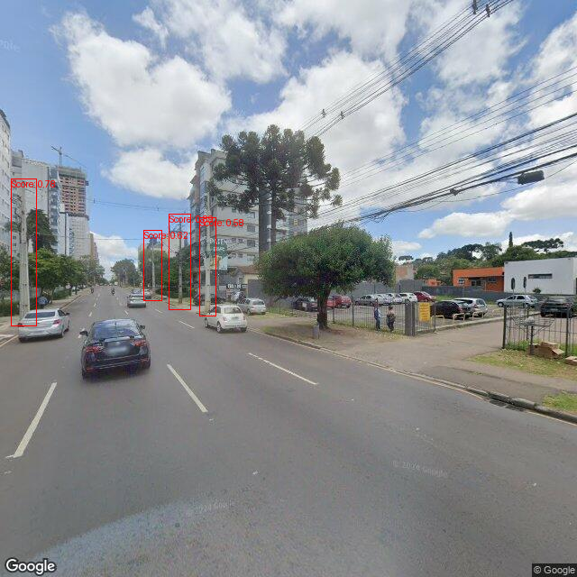

# SightlineSafari
## Using computer vision to find and seek objects on street view images

The goal of this project is to allow street object identification and geolocation using computer vision, depth estimatition and google street view images.

## Overview
SightlineSafari achieves the complex task of urban object recognition through a multi-step process:

* **Location Selection** - Define starting points for object search using latitude and longitude.
* **Panorama Retrieval** - Access the nearest Google Street View images to the chosen locations.
* **Coarse Object Identification** - Use computer vision to detect objects within these panoramic images.
* **Geolocation Estimate** - Calculate objects' positions based on image data and monocular depth estimation models.
* **"Safari" (walk)** - Fetch successive images closer to the identified objects to refine our understanding.
* **Fine Object identification** - Apply a second layer of computer vision to precisely classify the objects.
* **Map Creation** - Generate a geodataframe mapping all identified objects, complete with labels.

Consequently, as the "outputs" of the program we have good quality images of each searched object in the Sightline of the selected locations, and a map of each of these objects.

## Results

Considering the problem of street pole identification and categorization (between electric pole, telecom pole, etc) the results obtained would be these:

<p align="center">
    
</p>


*Map (drawn from a geodataframe) showing starting locations in yellow, identified objects in blue, and manually annotated real objects in red. All points drwan with a 5 meter radius*

<p align="center">
    
    
    <br />
    
    
</p>

*From top left to bottom right: Initial panorama, first step, second step, and focused object. Demonstrates the iterative approach to object identification.*

## Usage

* **Clone the Repository**: Clone the repo to your local machine.

* **Environment Configuration**: Set up the following environment variables for your Google Cloud and model configurations. We recommend using a tool like dotenv or your operating system's method of setting environment variables:
    * API_KEY: Your Google Cloud API key with Street View Static API enabled.
    * API_URL_SECRET: The URL signing secret for the API key above.
    * SERVICE_ACCOUNT_JSON_PATH: Path to your Google Cloud service account key.
    * PROJECT_NAME: Your Google Cloud project name.
    * BUCKET_NAME: Your Google Cloud Storage bucket name.
    * BUCKET_PATH: Path within your bucket to cache images.
    * DATASET_NAME (Optional): Target blob path to save images, if using dataset population.
    ```
    # Using a conda environment
    conda create -n sightlinesafari python=3.11.8
    conda activate sightlinesafari

    conda env config vars set API_KEY='street-view-static-API-key'
    conda env config vars set API_URL_SECRET='street-view-static-API-signing-secret'
    conda env config vars set SERVICE_ACCOUNT_JSON_PATH='/path/to/service-account-key.json'
    conda env config vars set PROJECT_NAME='gcp-project-name'
    conda env config vars set BUCKET_NAME='gcs-bucket-name'
    conda env config vars set BUCKET_PATH='path/to/street-view/image/cache'
    conda env config vars set DATASET_NAME='path/to/resulting_dataset'

    # Refresh env
    conda deactivate
    conda activate sightlinesafari
    ```

* **Install Dependencies**: Install the required dependencies by running:
    
    ``` pip install -r requirements.txt ```

    Find and install the proper [PyTorch version](https://pytorch.org/get-started/locally/) here. A torch version that satifies 2.0.0 < torch <= 2.1.x, since torch==2.2.x crashes the kernel, perhaps later versions will fix this problem.

* **Include Models**: Add pytorch models to the 'checkpoints' folder:
    * checkpoint for a fine-tuned yolov6 model which does object identification (general identification, same label for every object that will be searched).
    * checkpoint for a fine-tuned yolov6 model which does object classification (uses close up images of the objects to determine its label).
    * Both checkpoints required by Depth-Anything to do metric depth estimation. Found here [depth_anything_vitl14.pth](https://huggingface.co/spaces/LiheYoung/Depth-Anything/tree/main/checkpoints) and  [depth_anything_metric_depth_outdoor.pt](https://huggingface.co/spaces/LiheYoung/Depth-Anything/tree/main/checkpoints_metric_depth).
    * Add these model paths to the configs.py file (e.g. LR_MODEL_PATH = "./checkpoints/best_ckpt_longrange", do not include the extensions .pt or .pth in this string)

* **Run**: There are two notebooks that can be used to run the project:
    * model_tests.ipynb runs a single instance of the model for small scale experiments, analysis and testing.
    * parallel_orchestration.ipynb runs multiple instances of the project in parallel for larger scale experiments. Does not yet support multiple GPUs in parallel.

* **Inputs**: List of starting locations given as a dataframe containing both a "LATITUDE" and a "LONGITUDE" column.

* **Outputs**: There are several outputs to the model and they can be customized depending on needs.
    * Pickle file (stored by default on ./world_models) containing an object of the ./core/world World() object. This object contains a geodataframe with the positions of all the identified objects and their labels.
    * All the street view images obtained via API calls, stored by default on a google cloud storage bucket that works as a cache. This caching improves time performance and avoids repeated (and costly) street view static API calls.

## Implementation Details

The cruxes of this problem are: effectively identifying objects based on the panoramas, obtaining good positional estimates for the identified objects and creating walks that properly "chase" an object. If these two tasks are done perfectly, the rest of the work is easy. Lets look into how to solve these issues with the example of finding and classifying street poles (e.g. traffic poles, electric poles and telecom poles).

### Object identification

For each of the panoramas obtained for a location we must identify every pole in the image. The first barrier we encounter is that objects may be far from the location and classification is not easy in such contexts, so we first use the coarse (LongRange) vision model which identifies poles in general, but does not categorize them. 

The chosen/recommended model for this is [yolov6](https://github.com/meituan/YOLOv6) (for which inference functions are implemented in this project), which is a solid backbone for vision. Depending on the object you are searching, you will need to fine-tune the model to your data and point to the checkpoint of this model on the configs.py file.


### Positional Estimation

In order to estimate the position of an object based on a google street view image we need 4 things: geolocation of the image, heading of the image (in degrees, north=0, south=180), object bounding box, monocular object depth estimation. With this data, we can "draw" a line passing through the image source and the bounding box of the object, and then determine the final position based on how "deep" the object is on this line.

The first two are available via the API call and the metadata obtained from it, and the bounding box comes from the vision model, so the only remaining point is the object depth estimation based on the panorama image we have. 

This is called monocular depth estimation and it is a common task in computer vision for which, currently, the best performing approaches are deep neural networks, so that is what we used in this project. The chosen/recommended model for this is [Depth-Anything](https://github.com/LiheYoung/Depth-Anything) (for which inference functions are implemented in this project), for which it is recommended to use the metric outdoors fine-tuned checkpoint, available on [checkpoint](https://huggingface.co/spaces/LiheYoung/Depth-Anything/tree/main/checkpoints_metric_depth). Once again, make sure to point to this checkpoint on the configs.py file.

The output of the depth estimation model is still not sufficient to estimate the position since the model gives us a depth map of the full image. Because of this we have to crop the image to only contain the bounding box corresponding to the target object. However, the bounding box also contains the backgorund of the object, so we cannot just compute the average depth inside the bounding box or something alike. To further "focus" our depth estimation on the object only, classical computer vision approaches such as edge detection are used to eliminate the background and "select" the object, finally the mode of the depth estimate for the remaining area is computed to obtain a final depth estimate.

### Safaris (Walks)

The main barrier for classification is that objects identified may be far from the source position of the panorama, in which case it will be hard to classify them. To solve this issue, we need to "walk" towards objects by fetching a google street view image that is closer to this object. At first glance, this may seem like an easy task considering that we have the estimated position of this object, however, in practice this is not as easy as it seems. 

Firstly, lets consider the ideal scenario in which our positional estimate is perfect. In this case, to get a better image, we could follow these steps: create a google street view metadata API call with this estimated position, which would return the closest position for which a google street view image available. Based on the two positions (estimated and closest available), we could determine the header that must be used in the actual google street view API call, such that the image is facing the target object. This process of obtaining a second image from a new position is referred to as a step.

However, the positional estimation is naturally flawed since monocular depth estimation is not (yet) fully solved. As a consequence, an array of problems arises if we are not careful. For example, when obtaining the second image closer to the target, if the estimate is off, the computed heading may be wrong and the target object may not be pictured in the image, as it could be facing the other way. Even if an object exists in the second image, it is hard to determine if this object is the same that was seen in the panorama, as perspective, size and other properties changed.

To account for these issues, this project implements an iterative approach to the objects, taking "small" steps towards the object so that the impact of the variance in positional estimate is reduced. More specifically, this is done by fetching intermediary images between the source image position and the estimated position, basically always undershooting the step taken. This is done because undershooting a step is highly preferable when compared to overshooting a step, since the change in heading is much lesser for an undershot step than for an overshot one, and this assures a much higher probability of the object actually being pictured in the image fetched after the step.

This turns the process into a recursive search of the object, after each step, identify objects on the image and, if required, take more steps towards them until a good quality image is obtained. The only problem is that we may always find new objects to "chase", eventually covering the whole of google street view (something we want to avoid as that would be VERY expensive). To solve this, we only walk towards objects that were identified in the panoramas, and not in the images resulting from steps.

Walks can also be cut short in some scenarios, for example, if no objects are identified in a image after a step (could be that we overshot or that the identification model "changed its mind" with a clearer image of the object), or if the objects identified are too different from the target object identified in the panorama. To assess how "different" objects are, we could use object re-identification (to be implemented) or the object classification model (objects of different classes), but for now an object is too different from another if its estimated positions are too distant from one another.

Furthermore, one of the parameters of the model is the maximum number of steps that can be taken. This may range from 0, in which case no steps are taken and the map of the identified objects is obtained only from the panoramas, to +inf, in which case the search will only stop if no google street view images closer to the estimated position are available. For practical purposes, anything above 3 steps is overkill, and the choice between [0, 1, 2] steps depends mostly on the desired accuracy of the mapping and the quality of the final image of the object, with more steps yielding better results at a higher cost, both in terms of inference and API calls.

## License

This project is licensed under the MIT License - see the [LICENSE](LICENSE) file for details.